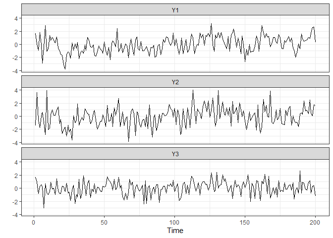
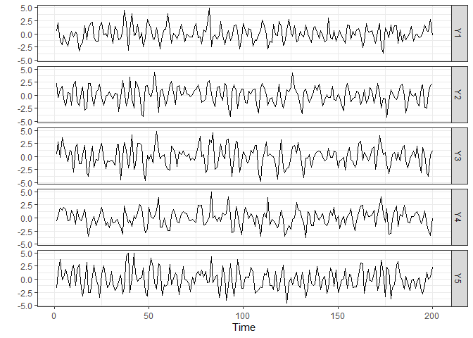
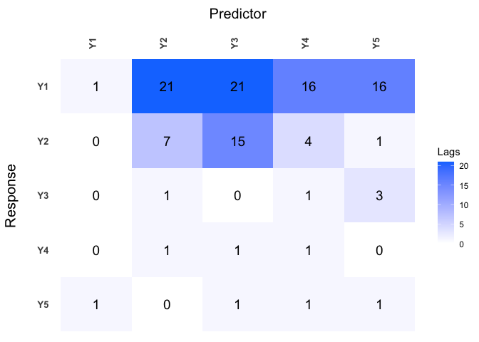
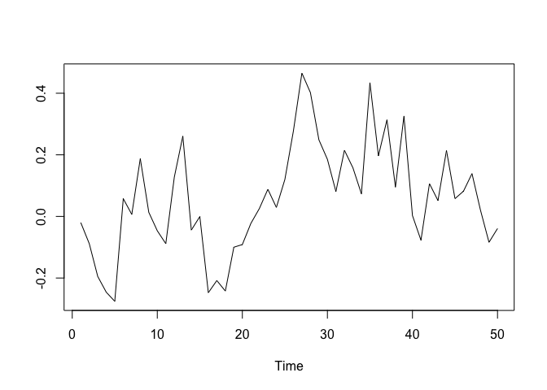
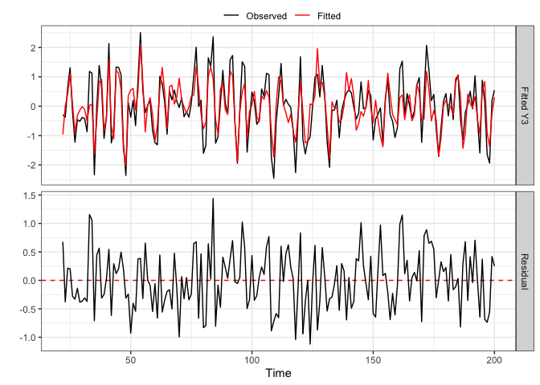

<!-- README.md is generated from README.Rmd. Please edit that file -->

# bigtime: Sparse Estimation of Large Time Series Models

<!-- badges: start -->

[](https://cran.r-project.org/package=bigtime)
[](https://cran.r-project.org/package=bigtime)
[](https://www.gnu.org/licenses/old-licenses/gpl-2.0.html)
[](https://www.gnu.org/licenses/gpl-3.0.html)
<!-- badges: end -->

The goal of `bigtime` is to sparsely estimate large time series models
such as the Vector AutoRegressive (VAR) Model, the Vector AutoRegressive
with Exogenous Variables (VARX) Model, and the Vector AutoRegressive
Moving Average (VARMA) Model. The univariate cases are also supported.

## Installation

You can install bigtime from github a follows:

``` r
# install.packages("devtools")
devtools::install_github("ineswilms/bigtime")
```

## Plotting the data

We will use the time series contained in the `example` data set. The
first ten columns in our dataset are used as endogenous time series in
the VAR and VARMA models, and the last five columns are used as
exogenous time series in the VARX model. Note that we remove the last
observation from our dataset as we will use this one to illustrate how
to evaluate prediction performance. We start by making a plot of our
data.

``` r
library(bigtime)
data(example)
Y <- example[-nrow(example), 1:10] # endogenous time series
Ytest <- example[nrow(example), 1:10]
X <- example[-nrow(example), 11:15] # exogenous time series

par(mfrow=c(5,2), mar=c(2.5, 2.5, 1, 1))
for(i in 1:ncol(Y)){
  plot(Y[,i], type="l", ylab="", xlab="Time", main=paste("Endogenous Time series", i))
}
```

<!-- -->

``` r

par(mfrow=c(3,2), mar=c(2.5, 2.5, 1, 1))
for(i in 1:ncol(X)){
  plot(X[,i], type="l", ylab="", xlab="Time", main=paste("Exogenous Time series", i))
}
```

<!-- -->

## Multivariate Time Series Models

### Vector AutoRegressive (VAR) Models

To make estimation of large VAR models feasible, one could start by
using an L1-penalty (lasso penalty) on the autoregressive coefficients.
To this end, set the `VARpen` argument in the `sparseVAR` function equal
to L1. A time-series cross-validation procedure is used to select the
sparsity parameters. The default is to use a cross-validation score
based on one-step ahead predictions but you can change the default
forecast horizon under the argument `h`. The function `lagmatrix`
returns the lagmatrix of the estimated autoregressive coefficients. If
entry \((i,j)=x\), this means that the sparse estimator indicates the
effect of time series \(j\) on time series \(i\) to last for \(x\)
periods.

``` r
VARL1 <- sparseVAR(Y=Y, VARpen="L1", selection = "cv") # default forecast horizon is h=1; using cross-validation
par(mfrow=c(1, 1))
LhatL1 <- lagmatrix(fit=VARL1, returnplot=T)
```

<!-- -->

The lag matrix is typically sparse as it contains soms empty (i.e.,
zero) cells. However, VAR models estimated with a standard L1-penalty
are typically not easily interpretable as they select many high lag
order coefficients (i.e., large values in the lagmatrix).

To circumvent this problem, we advise using a lag-based hierarchically
sparse estimation procedure, which boils down to using the default
option HLag for the `VARpen` argument. This estimation procedures
encourages low maximum lag orders, often results in sparser lagmatrices,
and hence more interpretable models:

``` r
VARHLag <- sparseVAR(Y=Y, selection = "cv") # VARpen="HLag" is the default
par(mfrow=c(1, 1))
LhatHLag <- lagmatrix(fit=VARHLag, returnplot=T)
```

<!-- -->

### Vector AutoRegressive with Exogenous Variables (VARX) Models

Often practitioners are interested in incorparating the impact of
unmodeled exogenous variables (X) into the VAR model. To do this, you
can use the `sparseVARX` function which has an argument `X` where you
can enter the data matrix of exogenous time series. When applying the
`lagmatrix` function to an estimated sparse VARX model, the lag matrices
of both the endogenous and exogenous autoregressive coefficients are
returned.

``` r
VARXfit <- sparseVARX(Y=Y, X=X) # VARX models always to Cross-Validation 
par(mfrow=c(1, 2))
LhatVARX <- lagmatrix(fit=VARXfit, returnplot=T)
```

<!-- -->

### Vector AutoRegressive Moving Average (VARMA) Models

VARMA models generalized VAR models and often allow for more
parsimonious representations of the data generating process. To estimate
a VARMA model to a multivariate time series data set, use the function
`sparseVARMA`. Now lag matrices are obtained for the autoregressive (AR)
coefficients and the moving average (MAs) coefficients.

``` r
VARMAfit <- sparseVARMA(Y=Y)  # VARMA models always do Cross-Validation
par(mfrow=c(1, 2))
LhatVARMA <- lagmatrix(fit=VARMAfit, returnplot=T)
```

<!-- -->

## Evaluating Forecast Performance

To obtain forecasts from the estimated models, you can use the
`directforecast` function. The default forecast horizon (argument `h`)
is set to one such that one-step ahead forecasts are obtained, but you
can specify your desired forecast horizon. Finally, we compare the
forecast accuracy of the different models by comparing their forecasts
to the actual time series values. In this example, the VARMA model has
the best forecast performance (i.e., lowest mean squared prediction
error). This is no surprise as the multivariate time series \(Y\) was
generated from a VARMA model.

``` r
VARf <- directforecast(VARHLag) # default is h=1
VARXf <- directforecast(VARXfit)
VARMAf <- directforecast(VARMAfit)

mean((VARf-Ytest)^2)
#> [1] 2.789974
mean((VARXf-Ytest)^2)
#> [1] 2.491267
mean((VARMAf-Ytest)^2) # lowest=best
#> [1] 2.114305
```

## Univariate Models

The functions `sparseVAR`, `sparseVARX`, `sparseVARMA` can also be used
for the univariate setting where the response time series \(Y\) is
univariate. Below we illustrate the usefulness of the sparse estimation
procedure as automatic lag selection procedures.

### AutoRegressive (AR) Models

We start by generating a time series of length \(n=50\) from a
stationary AR model and by plotting it. The `sparseVAR` function can
also be used in the univariate case as it allows the argument `Y` to be
a vector. The `lagmatrix` function gives the selected autoregressive
order of the sparse AR model. The true order is one.

``` r
n <- 50
y <- rep(NA, n)
y[1] <- rnorm(1, sd=0.1)
for(i in 2:n){
  y[i] <- 0.5*y[i-1] + rnorm(1, sd=0.1)
}
par(mfrow=c(1,1))
plot(y, type="l", xlab="Time", ylab="")
```

<!-- -->

``` r
ARfit <- sparseVAR(Y=y, selection = "cv")
lagmatrix(fit=ARfit)
#> $LPhi
#>      [,1]
#> [1,]    0
```

### AutoRegressive with Exogenous Variables (ARX) Models

We start by generating a time series of length \(n=50\) from a
stationary ARX model and by plotting it. The `sparseVARX` function can
also be used in the univariate case as it allows the arguments `Y` and
`X` to be vectors. The `lagmatrix` function gives the selected
endogenous (under `LPhi`) and exogenous autoregressive (under `LB`)
orders of the sparse ARX model. The true orders are one.

``` r
n <- 50
y  <- x <- rep(NA, n)
x[1] <- rnorm(1, sd=0.1)
y[1]  <- rnorm(1, sd=0.1)
for(i in 2:n){
  x[i] <- 0.8*x[i-1] + rnorm(1, sd=0.1)
  y[i] <- 0.5*y[i-1] + 0.2*x[i-1] + rnorm(1, sd=0.1)
}
par(mfrow=c(1,1))
plot(y, type="l", xlab="Time", ylab="")
```

<!-- -->

``` r
ARXfit <- sparseVARX(Y=y, X=x) 
lagmatrix(fit=ARXfit)
#> $LPhi
#>      [,1]
#> [1,]    1
#> 
#> $LB
#>      [,1]
#> [1,]    0
```

### AutoRegressive Moving Average (ARMA) Models

We start by generating a time series of length \(n=50\) from a
stationary ARMA model and by plotting it. The `sparseVARMA` function can
also be used in the univariate case as it allows the argument `Y` to be
a vector. The `lagmatrix` function gives the selected autoregressive
(under `LPhi`) and moving average (under `LTheta`) orders of the sparse
ARMA model. The true orders are one.

``` r
n <- 50
y <- u <- rep(NA, n)
y[1] <- rnorm(1, sd=0.1)
u[1] <- rnorm(1, sd=0.1)
for(i in 2:n){
  u[i] <- rnorm(1, sd=0.1)
  y[i] <- 0.5*y[i-1] + 0.2*u[i-1] + u[i]
}
par(mfrow=c(1,1))
plot(y, type="l", xlab="Time", ylab="")
```

<!-- -->

``` r
ARMAfit <- sparseVARMA(Y=y) 
lagmatrix(fit=ARMAfit)
#> $LPhi
#>      [,1]
#> [1,]    1
#> 
#> $LTheta
#>      [,1]
#> [1,]    0
```

## Additional Resources

For a non-technical introduction to VAR models see this interactive
[notebook](https://mybinder.org/v2/gh/enweg/SnT_VARS/main?urlpath=shiny/App/)
and for an interactive notebook demostrating the use of BigTime for
high-dimensional VARs, see this
[notebook](https://mybinder.org/v2/gh/enweg/SnT_BigTime/main?urlpath=shiny/App/).
*Note: Loading these notebook sometimes can take quite some time. Please
be patient or try another time.*

## References:

  - Nicholson William B., Bien Jacob and Matteson David S. (2020),
    “High-dimensional forecasting via interpretable vector
    autoregression”, Journal of Machine Learning Research, 21(166),
    1-52.

  - Wilms Ines, Sumanta Basu, Bien Jacob and Matteson David S. (2017),
    “Sparse Identification and Estimation of High-Dimensional Vector
    AutoRegressive Moving Averages”, arXiv:1707.09208.

  - Wilms Ines, Sumanta Basu, Bien Jacob and Matteson David S. (2017),
    “Interpretable Vector AutoRegressions with Exogenous Time Series”,
    arXiv.
